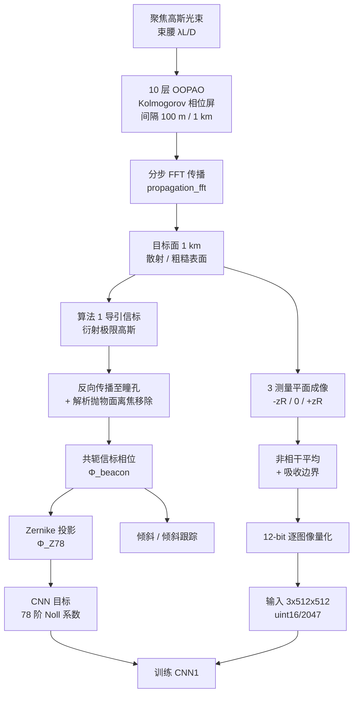
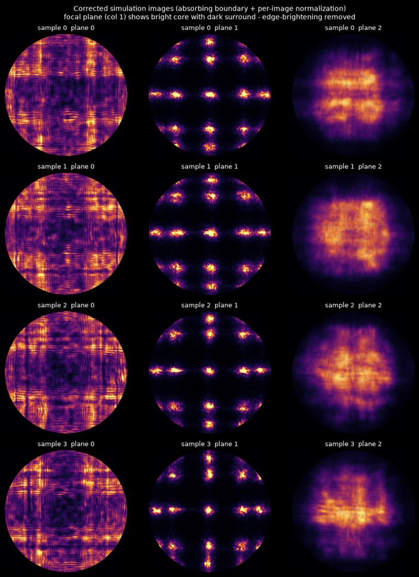
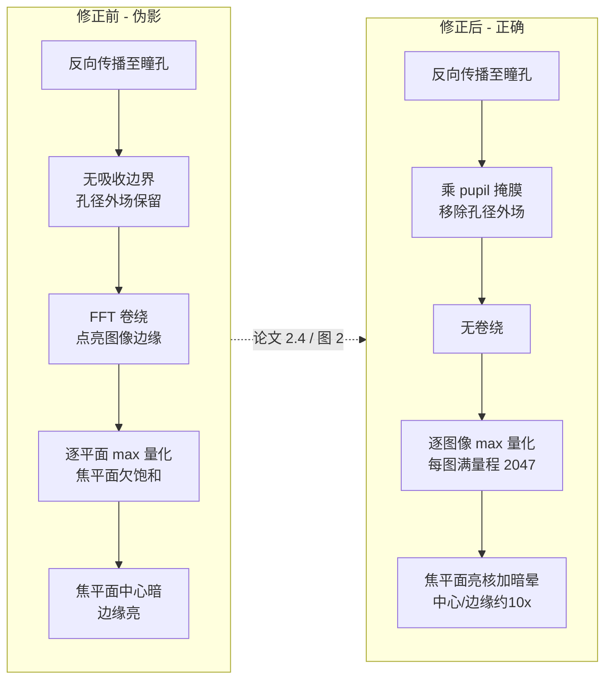
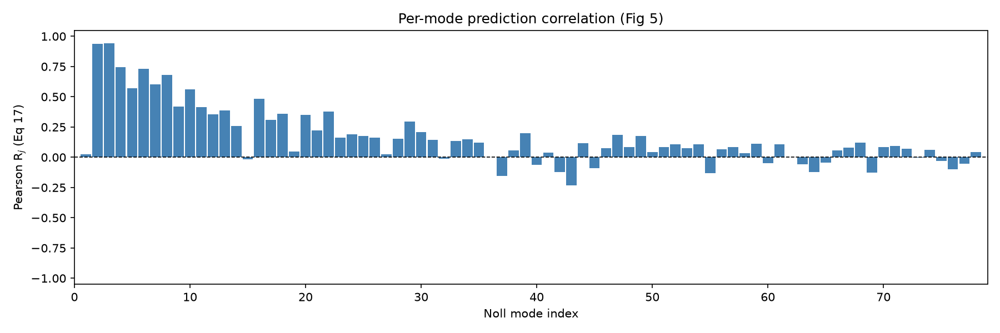
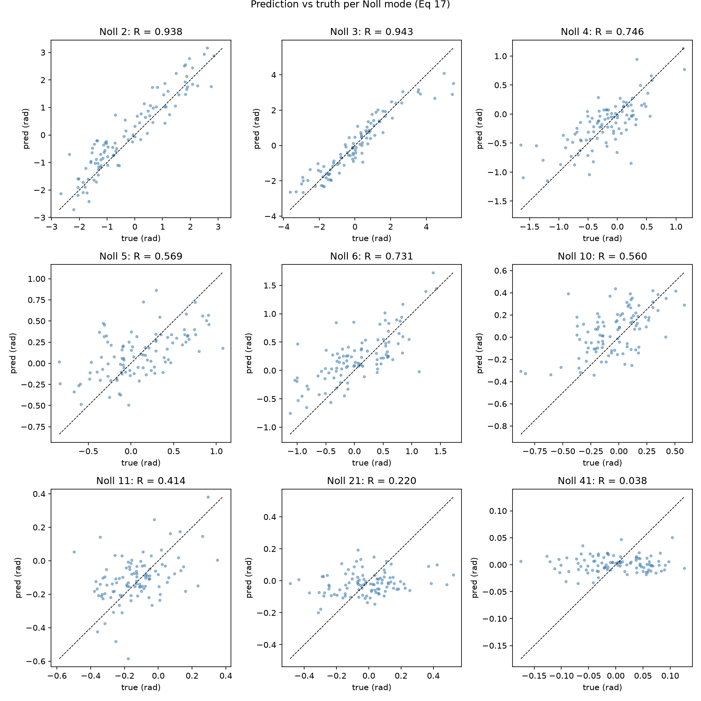
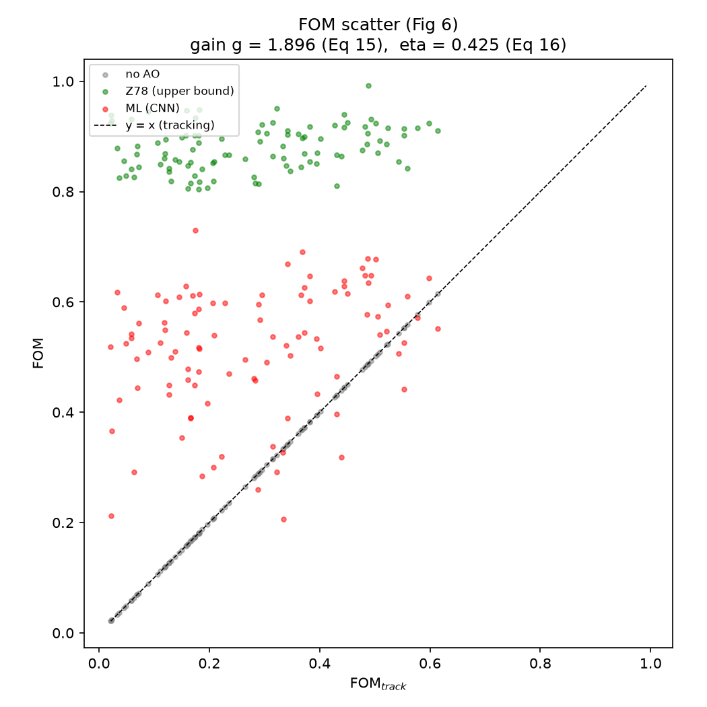
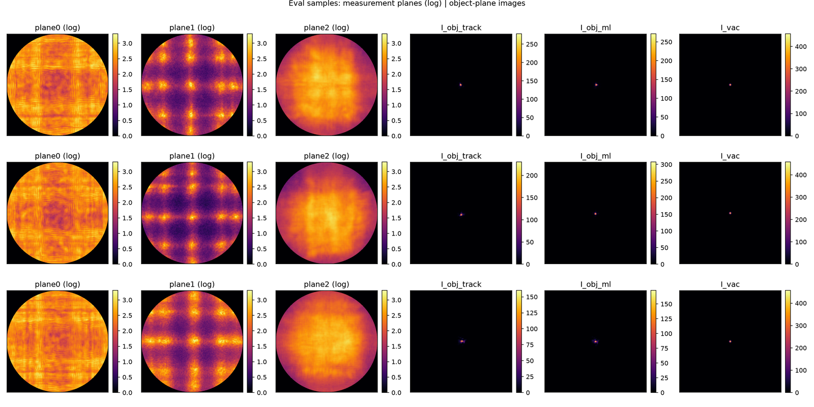

# Beaconless ML-AO：全流程报告

对 DiComo 等人 *"Beaconless adaptive optics for atmospheric laser propagation
with multi-plane convolutional neural network,"* Opt. Express 33(15):31010
(2025)，DOI 10.1364/OE.561077 的复现与扩展——现已基于 **OOPAO** 库重建湍流屏
幕基底，增加了逐方法输入预处理冒烟测试，并按论文第 2.4 节 / 图 2 修正了多平面
成像（吸收边界 + 逐图像归一化）。

| 制品 | 位置 |
|------|------|
| 数据集（OOPAO 屏幕，已修正成像） | `data/beaconless_demo.h5`（2 500 个样本，3.93 GB） |
| 模型检查点 | `checkpoints/best.pt`（CNN1，266 MB） |
| 评估图表 | `results/fig_*.png`（已入库，GitHub 可渲染） |
| 评估指标 | `results/results.json`（已入库） |
| 本报告 | `REPORT.md` |
| WandB 项目 | https://wandb.ai/ywzhang909/beaconless-ao-sim |
| 训练运行 | `curious-shape-18`（`krg3hrzn`） |
| 评估运行 | `zkm1bhiq` |
| 预处理冒烟运行 | `s9st1raa` |

---

## 1. 物理模拟与数据生成

### 1.1 流程（算法 1）

`data/simulate.py` + `physics/` 实现完整链路：

1. **湍流屏幕** — 10 层 Kolmogorov / von-Karman 相位屏幕，1 km 路径上每隔
   100 m 一层（Cn² = 8.13e-15，L0 = 100 m，λ = 800 nm）。
2. **分步传播** — 聚焦高斯光束（束腰 `λL/D`）通过 10 层屏传播至 1 km 处的目标
   （`physics/propagation_fft.py`）。
3. **算法 1 导引信标** — 发射衍射极限高斯信标，传播至目标后**反向传播至瞳孔**
   并进行解析抛物面离焦移除。共轭后的信标相位即为无信标自适应光学的波前估计。
4. **Zernike 投影** — `Φ_Z78 = M_Z78(M⁺_Z78 Φ_beacon)`（78 阶 Noll 截断，
   `physics/zernike_aotools.py`）作为 CNN 目标。
5. **多平面成像** — 3 个测量平面（焦平面附近 ±z_R，公式 12），粗糙表面散射
   （10 个 realization），12-bit 量化（公式 13）。

完整数据流（算法 1）：



### 1.2 OOPAO 集成（本工作）

湍流屏幕基底已重建为 **OOPAO** 库
（[github.com/cheritier/OOPAO](https://github.com/cheritier/OOPAO)），
内嵌于 `physics/oopao/`（Atmosphere，Telescope，Source，Zernike，phaseStats，
tools）。

`physics/oopao_backend.py`（`OopaoScreenBackend`）：
- 从 OOPAO `Atmosphere` 中抽取每层 von-Karman 屏幕。
- 将每层屏幕中心裁剪至 512×512 的瞳孔网格。
- **按比例缩放**每层振幅至目标每 slab r0（`r0_slab = r0_path · n^(3/5)`，
  800 nm 下的 r0 由 Cn²·L 导出）。OOPAO 在 500 nm 下表达 r0 且其 OPD 以
  **弧度** 为单位，因此需进行 PSD 归一化修正（`(r0_slab / r0_ref)^(5/6)`）。
  最初使用朴素的 `^(5/6)` 缩放导致屏幕被过度驱动 4.8×；通过测量参考 r0
  下的每层 OPD 标准差修复了该问题。

通过 `physical.beam_source` 开关（`soapy | aotools | oopao`）接入
`data/simulate.py`；`config.yaml` 设置 `beam_source: "oopao"`。
自定义 FFT 分步传播器、算法 1 信标反向传播和多平面成像**全部保留** —
OOPAO 仅提供湍流 + 瞳孔 + Zernike 基底（它本身不支持将聚焦光束通过 N 层
slab 传播到远处目标）。

### 1.3 成像修正（本工作，论文第 2.4 节 / 图 2）

初版仿真的强度图出现**焦平面中心偏暗、边缘偏亮**的伪影。对照论文修正了两处：

1. **吸收边界 / 瞳孔掩膜**（第 2.4 节）——反向传播回望远镜后，
   落在孔径（`Dscope`）之外的散射场必须移除，否则它经 FFT 卷绕会点亮图像
   边缘。在 `_imaging` 中于反向传播后乘以 `pupil`，并对每个测量平面的强度
   再乘 `pupil`（传感器仅看到 `Dscope` 视场）。
2. **逐图像归一化**（图 2："图像分别进行了归一化处理"）——焦平面能量集中，
   离焦平面较弥散，若按数据集全局/逐平面最大值量化，焦平面将欠饱和。改为
   对每张图像按其自身最大值缩放到 12-bit 满量程（2047）。

修正后焦平面中心/边缘强度比由 ~3.7× 提升到 ~10–12×，边缘卷绕点亮消失，
图像呈现"亮核 + 暗晕"的正确聚焦形态。

成像修正前后对比（焦平面，中间列）：


*上图：修正前（焦平面中心暗、边缘亮，FFT 卷绕伪影）。下图：修正后（吸收边界 +
逐图像归一化，焦平面亮核 + 暗晕，边缘卷绕消失）。*



### 1.4 等效性与确定性

| 检查项 | 结果 |
|--------|------|
| 每 slab OPD 标准差，OOPAO / aotools | **0.84**（在 von-Karman 采样噪声范围内） |
| 同种子确定性（标签 & 图像） | **逐比特一致** |
| 测试套件 | **80 / 80 通过** |

### 1.5 数据集统计（OOPAO 屏幕）

`data/beaconless_demo.h5`，N_total = 2 500（2 000 训练 / 400 测试 / 100 评估），
种子调度 `master_seed + index`（master 20250830）。

| 分支 | 中位 FOM |
|------|----------|
| noao | 0.2697 |
| track | 0.2697 |
| beacon | 0.9317 |
| z78（78 阶上界） | 0.8818 |

`D/r0 ≈ 7.4` → 强湍流；78 阶上界接近跟踪基准（信标强度零点产生的相位支点
点使得任何 78 阶相位共轭器都无法指令）。

---

## 2. 模型

**CNN1**（`models/cnn.py`），按第 2.6 节 / 表 1：

- 3 阶段 CNN：`3×3 卷积（步幅 1，填充 0） → BatchNorm2d → ReLU → 2×2 MaxPool`，
  通道数 `[32, 64, 128]`。
- 输入 `(B, 3, 512, 512)` → 经 3 次池化后 `62×62` → `AdaptiveAvgPool2d((18,18))`
  → 展平 `128·18·18 = 41 472`。
- 共享 MLP：4 个隐藏 ReLU 层，每层 512 神经元 → 78 个 Zernike 输出。
- **约 19.4 M 参数。**

输入契约：3 通道强度图像，**uint16 / 2047**（12-bit 相机标度）。
输出：78 个 Zernike 系数，训练时 z 标准化（公式 14）。

---

## 3. 训练

`train.py`，表 1 超参数：

| | |
|---|---|
| 优化器 | Adam，lr 1e-4，β 0.9/0.999 |
| 损失 | z 标准化 Zernike 模式上的 MSE |
| 批次 | 32（微批次 8 × 4 梯度累积，受显存限制） |
| 步数 | 3 000（演示版；论文版 11 500） |
| AMP | FP16 autocast + grad scaler |
| 仿真 FOM 评估 | 每 500 步在 8 个样本上评估 |

**训练最终仿真 FOM（`krg3hrzn`）：**

| 指标 | 值 |
|--------|-------|
| 中位 FOM_ML（step 3000） | **0.4545** |
| 峰值中位 FOM_ML（step 1000） | 0.5311 |
| 增益 g（公式 15，step 3000） | **1.863** |
| η（公式 16，step 3000） | **0.319** |
| 最终 MSE 损失 | 0.2974 |

检查点：`checkpoints/best.pt`（仿真 FOM 最佳，step 1000），`checkpoints/last.pt`。

---

## 4. 评估（第 2.7 节）

`evaluate.py` 在 100 样本评估集上运行，OOPAO 数据集（`zkm1bhiq`）：

| 指标 | 值 |
|--------|-------|
| 中位 FOM noao | 0.2823 |
| 中位 FOM track | 0.2824 |
| 中位 FOM beacon | 0.9347 |
| 中位 FOM z78 | 0.8772 |
| 中位 FOM_ML | **0.5354** |
| 增益 g（公式 15） | **1.896** |
| η（公式 16） | **0.4254** |
| 平均 R_j（公式 17） | 0.1624 |

ML 分支（FOM_ML 0.535）优于 noao/track 基线（0.282）→ 增益 1.90，η 0.43。
修正成像（吸收边界 + 逐图像归一化）后，相比初版（FOM_ML 0.486 / 增益 1.72 /
η 0.34）整体提升：图像质量改善使网络学到更强的相位估计。


*图 5 风格：逐 Noll 模式 Pearson `R_j` 柱状图（Eq 17）。横轴为模式序号，纵轴为相关系数。*


*代表性模式（1,2,3,4,5,9,10,20,40）的预测 vs 真实散点图。*


*图 6 风格：FOM 散点图（`FOM_track` vs `FOM_noao`/`FOM_z78`/`FOM_ML`）。红色点为 ML 校正结果，位于跟踪线上方表示校正有效。*


*3 个评估样本的测量平面（前 3 列，log 标度）与目标面图像（后 3 列：track / ML / 真空）对比。*

---

## 5. 输入预处理冒烟测试（本工作）

`smoke_test.py` 对 7 种输入预处理方法在**受显存限制的 GPU** 上**逐一独立**
测试（批次 8 的批处理低显存前向传播）。对每种方法记录输入统计量、
CNN 主干特征图统计量（饱和 / 死特征诊断）、逐模式 Pearson R_j、
系数 RMS 误差以及物理仿真 FOM_ML。结果已上传至 WandB（`s9st1raa`）。

### 5.1 方法与结果

| # | 方法 | 输入均值 | 输入最大值 | 特征最大值 | 预测 RMS（rad） | R_j 均值 | **FOM_ML** |
|---|--------|-----------|-----------|----------|----------------|---------|-----------|
| 0 | **baseline_norm**（3 平面，/2047） | 0.072 | 1.0 | 5.52 | 0.145 | 0.195 | **0.565** |
| 1 | raw_uint16（3 平面，0–2047） | 148.2 | 2047 | 17 186 | 1382.9 | 0.143 | 0.00078 |
| 2 | minmax_sample（3 平面，逐样本） | 0.072 | 1.0 | 5.52 | 0.145 | 0.195 | 0.565 |
| 3 | minmax_global（3 平面，全局） | 0.072 | 1.0 | 5.52 | 0.145 | 0.195 | 0.565 |
| 4 | zscore（3 平面，逐集合 z-score） | ~0 | 9.93 | 70.69 | 3.34 | 0.143 | 0.0010 |
| 5 | oneplane_norm（1 焦平面，/2047） | 0.027 | 1.0 | 6.69 | 0.290 | 0.021 | 0.309 |
| 6 | oneplane_raw（1 焦平面，0–2047） | 55.7 | 2047 | 20 794 | 637.6 | 0.049 | 0.00073 |

### 5.2 发现

1. **尺度是一个硬约束。** 任何使像素值偏离 `/2047` 尺度（raw_uint16，
   zscore，oneplane_raw）的方法都会破坏网络：特征图饱和（特征最大值 71–20 794
   对比基线的 ~5.5）且系数误差急剧增大（RMS 3.3–1383 rad vs 0.145）。FOM_ML
   崩溃至 ~0。BatchNorm 层部分吸收了尺度，但 MLP 头部和下游去归一化
   （`c = y·σ + μ`）是针对 `/2047` 范围校准的，无法从 2047× 或 z 标准化的输入中
   恢复。

2. **min-max ≈ 基线（逐图像归一化后）。** 修正成像采用逐图像归一化（每张图
   自身 max = 2047），因此逐样本 / 全局 min-max 与 `/2047` 标度几乎恒等
   （FOM 0.565 = 基线）。这与初版数据集（逐平面 max 量化）下 minmax_global
   略低于基线的情况不同：逐图像归一化消除了逐平面 max 差异带来的尺度漂移。

3. **单平面退化但不会崩溃。** oneplane_norm（FOM 0.309）保留了合理的特征
   （特征最大值 ~6.7）并保留了部分校正能力，但相比基线损失了 ~45% 的 FOM。
   3 通道设计编码了用于深度感知相位恢复的 ±z_R 离焦视差；使用单平面时网络
   退化为 2D 相位估计，高阶 Zernike 模式精度下降（R_j 0.021 vs 0.195）。

4. **复合故障模式是灾难性的。** oneplane_raw（1 平面 + 错误尺度）是
   raw_uint16 之后最差的情况（FOM 0.00073，R_j ≈ 0.05）——两种违规叠加。

### 5.3 结论

CNN1 **不具有尺度不变性**，也**不具有平面冗余性**。训练输入契约——
3 个测量平面以 `/2047`（12-bit）尺度——是网络产生有用 Zernike 估计的硬性要求。
任何部署时预处理必须同时保留 3 平面结构和相机强度标度；min-max / z-score
归一化以及单平面裁剪会显著降低（或消除）校正性能。

---

## 6. 可复现性

```bash
uv sync
uv run python -m pytest tests/ -v            # 80/80

# 1. 数据（OOPAO 屏幕）：
uv run python -m data.generate_h5 --config config.yaml

# 2. 训练（GPU）：
CUDA_VISIBLE_DEVICES=1 uv run python train.py --config config.yaml

# 3. 评估 + WandB：
CUDA_VISIBLE_DEVICES=1 uv run python evaluate.py --config config.yaml --ckpt checkpoints/best.pt

# 4. 逐方法预处理冒烟测试：
CUDA_VISIBLE_DEVICES=1 uv run python smoke_test.py --config config.yaml --ckpt checkpoints/best.pt
```

GPU 说明：主机在两个 GPU 上运行 VLLM 工作进程（每个约 20.6 GiB），GPU 1
上仅剩约 3.4 GiB。上述所有 GPU 步骤均使用 `CUDA_VISIBLE_DEVICES=1` 并减小批次
（冒烟测试使用 `--batch-size 8`）以适应显存。

---

## 7. WandB 实验追踪与图表说明

项目地址：https://wandb.ai/ywzhang909/beaconless-ao-sim

本项目包含三个 WandB 运行，分别对应训练、评估和预处理冒烟测试。以下是各运行
记录的核心指标与图表的详细说明。

### 7.1 训练运行（`curious-shape-18`，`krg3hrzn`）

该运行记录训练过程的损失曲线、学习率、梯度范数以及周期性仿真 FOM 评估结果。

**标量指标：**

| 指标名称 | 记录频率 | 含义 |
|---------|---------|------|
| `train/loss` | 每 `log_every` 步 | 当前训练步的 MSE 损失（经过梯度累积后的均值）。用于监控训练收敛与过拟合。 |
| `train/lr` | 每 `log_every` 步 | 当前 Adam 优化器学习率（固定 1e-4）。 |
| `train/grad_norm` | 每 `log_every` 步 | 全局 L2 梯度范数。用于检测梯度爆炸（范数骤增）或梯度消失（范数接近 0）。 |
| `sim/median_fom_ml` | 每 `sim_eval_every`（500）步 | 当前模型在物理仿真环境下的中位 FOM。**核心监控指标**：随训练步数增加应单调上升。 |
| `sim/median_fom_track` | 每 500 步 | 纯跟踪策略（无 CNN 校正）的中位 FOM 基准，用于计算相对增益。 |
| `sim/median_fom_z78` | 每 500 步 | 78 阶 Zernike 重构（理想相位共轭上界）的中位 FOM。 |
| `sim/gain` | 每 500 步 | 相对跟踪的增益 `g = FOM_ML / FOM_track`（公式 15）。衡量 CNN 校正相对于无校正跟踪的提升倍数。 |
| `sim/eta` | 每 500 步 | CNN 效能 `η = (FOM_ML - FOM_track) / (FOM_Z78 - FOM_track)`（公式 16）。衡量 CNN 实现了理想上界与跟踪基准之间差距的百分之几。 |

**训练曲线解读：**
- `train/loss` 持续下降 → 模型正在学习训练集映射。
- `train/grad_norm` 稳定在合理范围（通常 0.1–10）→ 梯度流健康。
- `sim/median_fom_ml` 逐步上升（峰值 0.531 @ step 1000）后略有波动
  （step 3000 为 0.4545）→ 仿真环境下的校正能力在提升；当 `sim/gain > 1`
  时表示 ML 校正已超越纯跟踪。
- `sim/eta` 反映 ML 距离理论上界（Z78）还有多远；本实验最终 η ≈ 0.32，
  表明仍有提升空间。

### 7.2 评估运行（`zkm1bhiq`）

该运行在 100 样本独立评估集上执行第 2.7 节评估协议，记录最终聚合指标与四张
核心图表。

**标量指标：**

| 指标名称 | 含义 |
|---------|------|
| `gain` | 最终增益 `g = median(FOM_ML) / median(FOM_track)` = **1.896**。ML 校正使 FOM 达到跟踪基准的 1.90 倍。 |
| `eta` | 最终效能 `η = (median(FOM_ML) - median(FOM_track)) / (median(FOM_Z78) - median(FOM_track))` = **0.425**。ML 实现了理想上界与跟踪基准之间差距的 42.5%。 |
| `Rj_mean` | 78 个 Zernike 模式 Pearson 相关系数 `R_j`（公式 17）的均值 = **0.162**。反映整体预测精度。 |
| `median_fom/noao` | 无 AO 时的中位 FOM = 0.282。 |
| `median_fom/track` | 纯跟踪（仅倾斜校正）的中位 FOM = 0.282。 |
| `median_fom/beacon` | 理想导引信标（完美相位共轭）的中位 FOM = 0.935。 |
| `median_fom/z78` | 78 阶 Zernike 重构上界的中位 FOM = 0.877。 |
| `median_fom/ml` | **CNN 预测相位**的中位 FOM = **0.535**。 |

**图表：**

| 图表名称 | 含义 |
|---------|------|
| `fig_Rj_per_mode.png` | **图 5 风格：逐模式 Pearson `R_j` 柱状图**。横轴为 Noll 模式序号（1–78），纵轴为 `R_j`（公式 17）。每条柱子的高度表示该 Zernike 模式预测值与真实值的线性相关系数。`R_j ≈ 1` 表示完美预测，`R_j ≈ 0` 表示无预测能力，负值表示预测与真实值反相关。低阶模式（倾斜、离焦、像散）的 `R_j` 通常较高（0.5–0.95），高阶模式随阶数增加迅速衰减。 |
| `fig_pred_vs_true.png` | **代表性模式的预测 vs 真实散点图**。3×3 子图分别展示 Noll 1, 2, 3, 4, 5, 9, 10, 20, 40 模式。每个子图中，x 轴为真实系数（弧度），y 轴为预测系数；黑色虚线为 45° 参考线（完美预测）。点的分布越贴近虚线且越集中，表示该模式预测越准。子图标题标注了该模式的 Pearson `R` 值。该图用于直观验证系数量级与相关性的正确性。 |
| `fig_FOM_scatter.png` | **图 6 风格：FOM 散点图**。x 轴为 `FOM_track`（跟踪基准），y 轴分别为 `FOM_noao`（灰色）、`FOM_Z78`（绿色）、`FOM_ML`（红色）。黑色虚线 `y = x` 表示跟踪基准（ML 点位于线上方意味着校正优于跟踪）。点位于 x 轴上方越远，表示该样本下系统性能越好。标题中标注了增益 `g` 和效能 `η`。该图用于展示 ML 在不同湍流样本下的鲁棒性：理想情况下 ML 点应均匀分布在跟踪线上方。 |
| `fig_samples.png` | **评估样本可视化蒙太奇**。选取 3 个代表性评估样本，每行 6 列：前 3 列为三个测量平面的强度图像（log₁₀+1 标度，`inferno` 色图）；后 3 列分别为 `I_obj_track`（仅跟踪时的目标面强度）、`I_obj_ml`（ML 校正后的目标面强度）、`I_vac`（真空传播目标面强度，作为无湍流参考）。通过对比 `I_obj_track` 与 `I_obj_ml` 可直观看到 ML 校正对目标面像质恢复的效果；`I_vac` 用于标定衍射极限强度。 |

### 7.3 预处理冒烟测试运行（`s9st1raa`）

该运行对 7 种输入预处理方法逐一独立测试，记录每种方法的输入统计、CNN
特征图统计、系数误差、Pearson 相关性、仿真 FOM 以及多张诊断图表。

**标量指标（每种方法以 `{method}/` 为前缀，下划线替换为 `/`）：**

| 指标名称 | 含义 |
|---------|------|
| `{method}/input_mean` | 输入图像所有像素的均值。用于快速判断输入是否处于训练时的 `[0, 1]` 标度（基线均值 ~0.072）。 |
| `{method}/input_std` | 输入图像所有像素的标准差。 |
| `{method}/input_max` | 输入图像的最大像素值。基线 1.0（逐图像归一化后）；raw_uint16 可达 2047（未归一化）。 |
| `{method}/input_min` | 输入图像的最小像素值。 |
| `{method}/feat_mean_abs` | CNN 主干（3 个卷积块 + 全局平均池化后）128 个特征图均值绝对值的平均值。**关键诊断指标**：值过高（>10）表示特征图饱和；值过低或接近 0 表示大量神经元死亡。 |
| `{method}/feat_std_mean` | 128 个特征图标准差的均值。反映特征表达的丰富程度。 |
| `{method}/feat_max_mean` | 128 个特征图最大值的均值。**与 `feat_mean_abs` 共同诊断饱和**：基线约 5.52，raw_uint16 可达 17 186（严重饱和）。 |
| `{method}/pred_rms` | 预测系数与真实系数之间的 RMS 误差（弧度）。基线约 0.145 rad；raw_uint16 达 1382.9 rad（完全失效）。 |
| `{method}/rj_mean` | 78 个模式 `R_j` 的均值。基线约 0.195；raw_uint16 约 0.143（几乎无预测能力）。 |
| `{method}/rj_std` | 78 个模式 `R_j` 的标准差。 |
| `{method}/fom_ml_median` | 该预处理方法在物理仿真下的中位 FOM_ML。**最终性能指标**：基线 0.565，raw_uint16 约 0.00078。 |

**图表（每种方法独立记录）：**

| 图表名称 | 含义 |
|---------|------|
| `{method}/input_plane_grid` | 输入测量平面的图像网格（5 列排列），用于可视化不同预处理方法下网络的输入外观。 |
| `{method}/feat_stats_by_channel` | 128 个特征通道的统计量折线图（x 轴为通道序号，y 轴为统计量值）。三条曲线分别代表 `mean`（每通道均值绝对值）、`std`（每通道标准差）、`max`（每通道最大值）。用于逐通道诊断饱和与死特征。 |
| `{method}/pred_vs_true_tilt` | 模式 2（倾斜，tilt）的预测 vs 真实散点图。倾斜是最高能量的低阶模式，其预测质量直接影响整体校正效果。 |
| `{method}/rj_per_mode` | 78 个模式 `R_j` 的直方图分布（40 个分箱）。用于观察各方法下模式相关性的整体分布形态。 |

**汇总表：**

| 图表名称 | 含义 |
|---------|------|
| `summary/all_methods` | WandB 表格，汇总 7 种预处理方法的关键指标对比：方法名、输入均值、预测 RMS、`R_j` 均值、`FOM_ML` 中位值。便于在同一页面横向比较所有方法的优劣。 |

---

## 8. 图表索引

本地评估图表位于 `results/` 目录：

| 文件 | 描述 |
|------|------|
| `results/fig_Rj_per_mode.png` | 图 5 风格：逐 Noll 模式 Pearson `R_j` 柱状图（Eq 17）。 |
| `results/fig_pred_vs_true.png` | 代表性模式（1,2,3,4,5,9,10,20,40）的预测 vs 真实散点图。 |
| `results/fig_FOM_scatter.png` | 图 6 风格：FOM 散点图（`FOM_track` vs `FOM_noao`/`FOM_z78`/`FOM_ML`）。 |
| `results/fig_samples.png` | 3 个评估样本的测量平面 + 目标面图像蒙太奇。 |

---

## 9. 可复现性

```bash
uv sync
uv run python -m pytest tests/ -v            # 80/80

# 1. 数据（OOPAO 屏幕）：
uv run python -m data.generate_h5 --config config.yaml

# 2. 训练（GPU）：
CUDA_VISIBLE_DEVICES=1 uv run python train.py --config config.yaml

# 3. 评估 + WandB：
CUDA_VISIBLE_DEVICES=1 uv run python evaluate.py --config config.yaml --ckpt checkpoints/best.pt

# 4. 逐方法预处理冒烟测试：
CUDA_VISIBLE_DEVICES=1 uv run python smoke_test.py --config config.yaml --ckpt checkpoints/best.pt
```

GPU 说明：主机在两个 GPU 上运行 VLLM 工作进程（每个约 20.6 GiB），GPU 1
上仅剩约 3.4 GiB。上述所有 GPU 步骤均使用 `CUDA_VISIBLE_DEVICES=1` 并减小批次
（冒烟测试使用 `--batch-size 8`）以适应显存。
