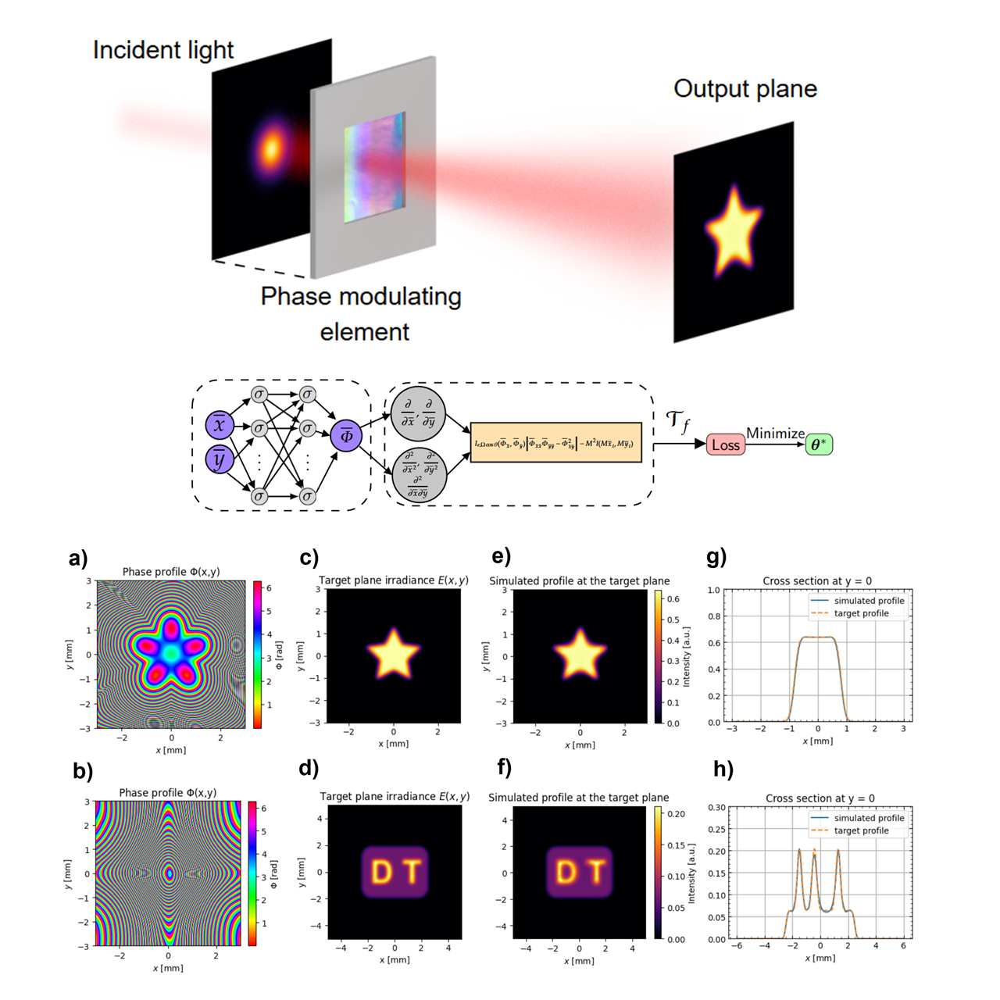

# Physics-Informed Neural Networks for Optimal Beam Shaping in Flat Optics

PINN-shaper provides research code and example notebooks for designing high-fidelity and high-performance phase profiles that transform a known input beam into a prescribed target intensity.

Compared with Gerchberg--Saxton and direct gradient-based optimization methods, this work reformulates the beam-shaping problem as a nonlinear PDE, which is solved with a PINN whose solutions yield smoother phase profiles, improved robustness, reduced speckle, and greater power directed to the desired target region. It enforces the underlying beam-shaping physics throughout training, which helps guide the solution toward physically meaningful phase maps.

The method supports both finite-distance and far-field beam shaping, including non-paraxial configurations. The resulting phases can be displayed on spatial light modulators (SLMs) or used as optimal starting points for further metasurface inverse design and topology optimization. The PINN is specially simple to train for low-spatial-frequency target patterns.

|||
:--------------------:|:--------------------:|
`Star-shaped flat-top (near field).ipynb` | `DT-letters-shaped flat-top (near field).ipynb` |
[Link to the example](https://github.com/rafael-fuente/pinn-shaper/blob/main/Star-shaped%20flat-top%20(near%20field).ipynb)| [Link to the example](https://github.com/rafael-fuente/pinn-shaper/blob/main/DT-letters-shaped%20flat-top%20(near%20field).ipynb)|

## Requirements

For installation, just clone this repository. The required packages are:

- `torch`
- `diffractsim`

For a CUDA-enabled installation, install the appropriate PyTorch build for your operating system.

## Main features

- Finite-distance phase design with `Nearfield_PINN`.
- Far-field angular phase design with `Farfield_PINN`.
- Non-paraxial generalized-Snell-law ray mappings.
- Energy conservation enforced through Monge--Ampère PDE residuals.
- Automatic differentiation of the first- and second-order phase derivatives.
- Automatic power normalization between the source and target distributions.
- Optional symmetry reduction for symmetric optical designs.
- Scalar diffraction validation with `diffractsim`.
- Gerchberg--Saxton comparison for the far-field example.
- Example trained models and target images for reproducing the supplied results.

## Citation

If you use `pinn-shaper` in your research, please cite the paper:

R. de la Fuente Herrezuelo, <i>Physics-Informed Neural Networks for Optimal Beam Shaping in Flat Optics</i> (2026), https://doi.org/10.48550/arXiv.2607.18012.