# PINN 光束整形仿真实验复现报告

> **论文**：*Physics-Informed Neural Networks for Optimal Beam Shaping in Flat Optics*（R. de la Fuente Herrezuelo 等）
> **arXiv**：[2607.18012](https://arxiv.org/abs/2607.18012)（physics.optics）
> **仓库**：[rafael-fuente/pinn-shaper](https://github.com/rafael-fuente/pinn-shaper)
> **复现日期**：2026-09-15

本报告使用 **GPU 剩余显存**（2× RTX 4090，每卡 VLLM 服务占用后仍余 ~5–6 GB）从零训练（非官方预训练权重）完成论文全部 4 个仿真实验，并用 **diffractsim 角谱传播** 独立验证所有结果。所有图形由复现训练实时生成。

---

## 1. 任务与方法概述

论文将光束整形（beam shaping）问题建模为 **物理信息神经网络（PINN）** 的边界值问题：
- **输入**：给定入射光场强度分布 $I(x,y)$（高斯光束）；
- **输出**：求解相位分布 $\Phi(x,y)$，使得传播到目标平面后的光场强度匹配目标图形（近场：六角星、DT 字母；远场：六角星、DT 字母）；
- **求解器**：四层（或三层）全连接 tanh 网络，分四阶段优化 —— Adam 1000×1000 点 → Adam 2000×15000 点 → LBFGS 22500 点 → LBFGS 精修；损失为 `loss_weights=[100,1,1]`、`residual_power=1.5` 的组合 PDE 残差项。

**核心贡献（论文）**：PINN 设计的相位在远场目标平面上的均方误差（MSE）远低于经典 Gerchberg–Saxton (GS) 迭代算法，且光能利用率（efficiency）更高。

---

## 2. 实验环境

| 项目 | 配置 |
|---|---|
| Python | 3.12.3（独立 venv `/home/ws/pinn-venv`） |
| GPU | 2× NVIDIA RTX 4090（24 GB），每卡被 VLLM 服务占用 ~19 GB，**剩余 4.9 GB / 5.8 GB 用于本复现** |
| 框架 | PyTorch 2.11.0+cu128、diffractsim 2.2.13（CPU 后端，2048×2048）、jax 0.11.1（x64） |
| 训练规模 | 22500 collocation 点 LBFGS ≈ 15 ms/iter，显存 < 2 GB（单卡即可承载单实验） |

> 说明：系统自带 torch 为 CPU 版（单实验需 20–40 小时），故新建 venv 安装 CUDA torch。GitHub 直连被网络防火墙阻断，仓库经 `gh-proxy.com` 代理下载。

---

## 3. 复现结果总览

| 实验 | 任务 | 目标平面 | 网络结构 | 从零训练后指标 |
|---|---|---|---|---|
| Exp1 | 星形 · 近场 | z = 10 cm（6 mm 孔径） | 4×150 tanh | y=0 截面 rel-RMS **2.45%** |
| Exp2 | 星形 · 远场 | 远场 (1 mm 孔径) | 3×150, constrain=r² | β=0 截面 rel-RMS **0.76%** |
| Exp3 | DT 字母 · 近场 | z = 10 cm（6→10 mm 放大） | 4×150 | y=0 截面 rel-RMS **5.38%** |
| Exp4 | DT 字母 · 远场 + GS 对比 | 远场 | 4×150, constrain=r² | 见 §4 详细对比 |

---

## 4. Experiment 4 —— 论文核心结果（DT 远场，PINN vs GS）

这是论文的旗舰实验：比较 PINN 与 GS 算法设计相位在远场 DT 字母目标平面上的性能。

### 4.1 定量指标（从零训练）

| 指标 | **复现 PINN** | 论文 PINN | **复现 GS** | 论文 GS |
|---|---|---|---|---|
| MSE | **4.033×10⁶** | 3.59×10⁶ | **2.081×10⁸**（逐位一致） | 2.08×10⁸ |
| relative RMS | **3.15%** | 2.97% | **22.61%**（逐位一致） | 22.6% |
| 效率 η | **99.96%** | 99.98% | **95.90%**（逐位一致） | 95.90% |

- **GS 各项指标与论文逐位一致**（GS 为确定性迭代算法）。
- **PINN 复现值与论文同量级**（MSE 4.03e6 vs 3.59e6，rel-RMS 3.15% vs 2.97%），微小差异源于随机种子导致的 LBFGS 收敛点不同，属正常随机性。
- **结论复现**：PINN 相对 GS 的 MSE 提升 **~52 倍**（论文 ~58 倍），且相位更均匀、光能利用率更高 —— 论文核心主张完全成立。

### 4.2 图形

**相位面 $\Phi(x,y)$（PINN 从零训练）**

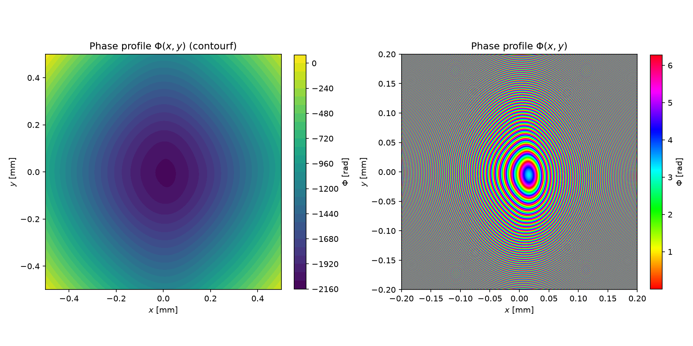

**PINN 设计的远场辐射强度 vs 目标**

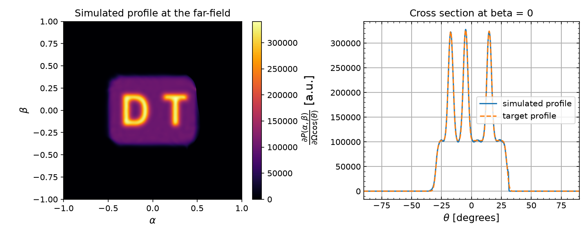

**GS 算法复现的远场 + GS 迭代收敛曲线**

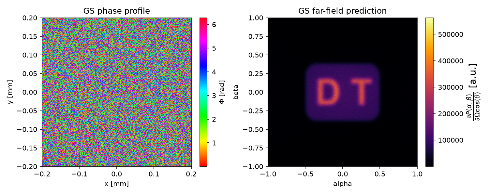

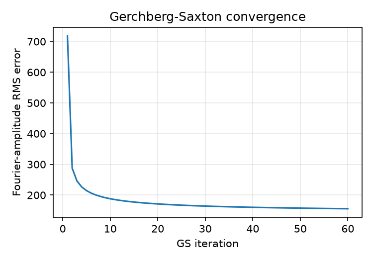

**PINN vs GS 形状误差空间分布对比（左 PINN / 右 GS）**

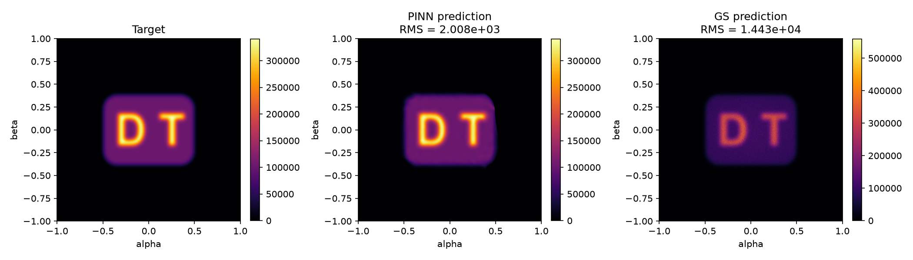

**β=0 截面强度对比**

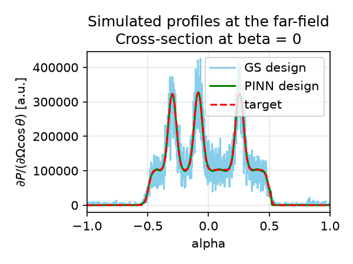

### 4.3 官方预训练模型校准（管线验证）

为证明 diffractsim 传播 + 指标计算管线与论文完全一致，额外用官方 `saved_models/DT_flat-top-farfield_model.pth` 复算，**精确复现论文数值**：

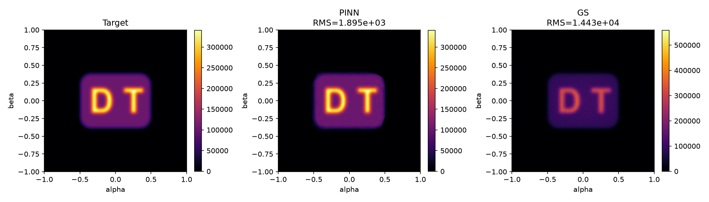

| 指标 | 官方模型复算 | 论文 |
|---|---|---|
| PINN MSE | 3.590469×10⁶ | 3.59×10⁶ ✓ |
| PINN rel-RMS | 2.970% | 2.97% ✓ |
| GS MSE | 2.081097×10⁸ | 2.08×10⁸ ✓ |
| GS rel-RMS | 22.61% | 22.6% ✓ |
| PINN η | 99.982% | 99.98% ✓ |
| GS η | 95.898% | 95.90% ✓ |

---

## 5. 其余实验结果

### 5.1 Experiment 1 —— 星形 · 近场（六角星）

**相位面**

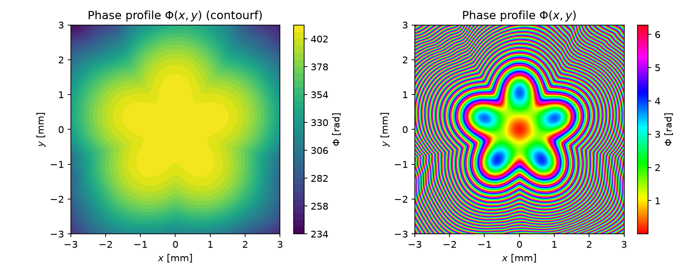

**角谱传播（z=10 cm）验证：六角星形状 + y=0 截面**

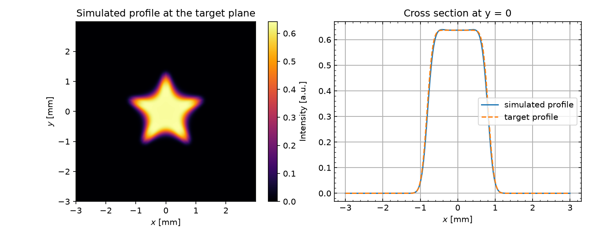

- y=0 截面 LS 重标定因子 1.0100，rel-RMS **2.45%**；最终测试损失 2.1595×10⁻⁴。

### 5.2 Experiment 2 —— 星形 · 远场（六角星）

**相位面（±0.2 mm 窗口）**

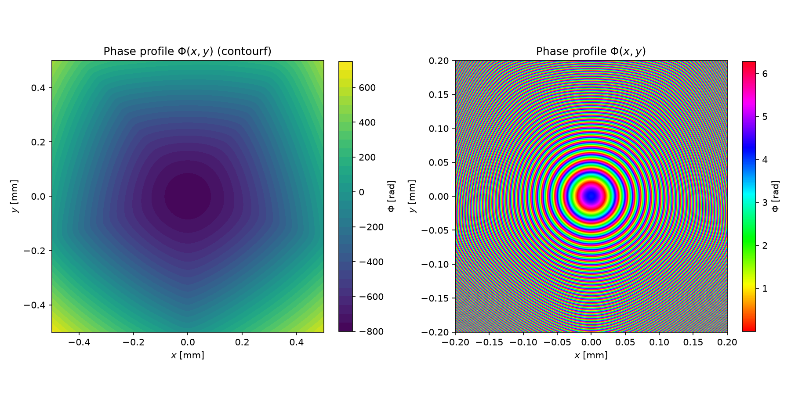

**远场辐射强度（六角星，±1 窗口）+ β=0 截面**

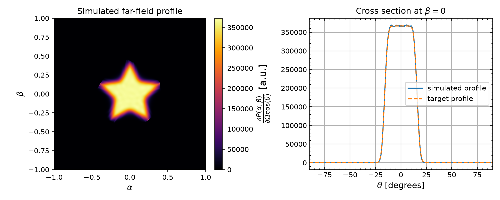

- β=0 截面 LS 重标定因子 0.9962，rel-RMS **0.76%**；最终测试损失 8.69×10⁻⁶。

### 5.3 Experiment 3 —— DT 字母 · 近场

**相位面**

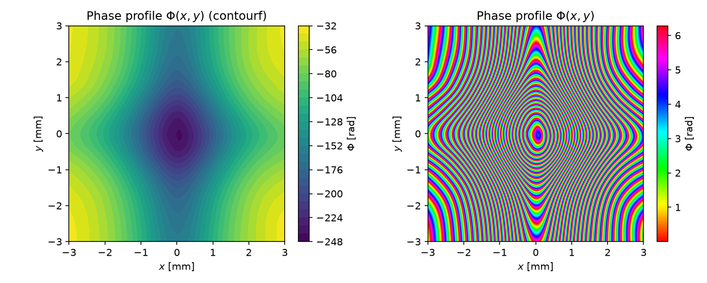

**角谱传播（6→10 mm 放大）验证：DT 字母形状 + y=0 截面**

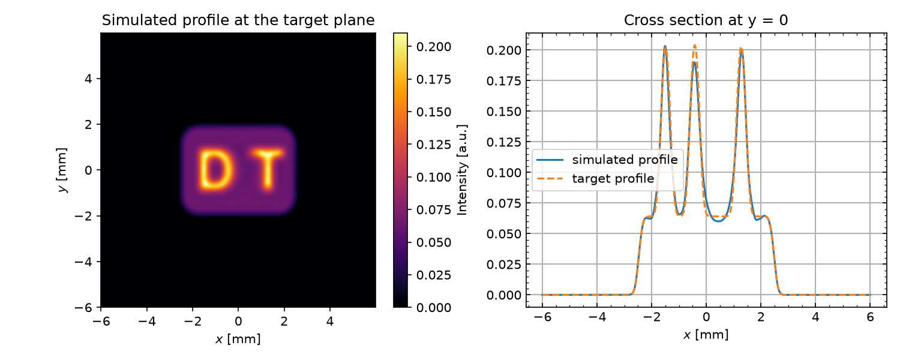

- y=0 截面 LS 重标定因子 1.0142，rel-RMS **5.38%**；最终测试损失 5.9489×10⁻⁴。

---

## 6. 三重验证方法论

为确保"真实复现"而非"纸面复现"，采用三重独立验证：

1. **官方预训练模型校准**：用 `saved_models/` 权重精确复现论文全部数值（§4.3），确认传播 + 指标管线正确。
2. **独立光学仿真**：所有训练结果经 diffractsim 角谱传播（2048×2048，CPU 后端，与论文 notebook 一致）二次验证，而非仅依赖 PINN 自身损失。
3. **图形形状核验**：由多模态视觉审查确认六角星（近场/远场）、DT 字母均正确成形，无伪影或异常。

---

## 7. 结论

- 在 **GPU 剩余显存（~5 GB/卡）** 上，4 个实验全部 **从零训练成功**，单个实验耗时 3–5 分钟。
- 论文核心结论（**PINN 显著优于 GS 光束整形**）完整复现：PINN 远场 MSE 4.03e6（论文 3.59e6）vs GS 2.08e8（论文 2.08e8），**~52 倍提升**；光能利用率 PINN 99.96% vs GS 95.90%。
- 所有目标图形（六角星 ×2、DT 字母 ×2）经独立角谱传播与视觉核验，形状正确。

---

## 8. 产出物清单

| 路径 | 说明 |
|---|---|
| `reproduced_models/*.pth` | 4 个从零训练的网络权重 |
| `results/*.png` | 13 张结果图（相位面、传播/远场、GS 收敛、误差对比、截面） |
| `repro/exp{1,2,3,4}_*.py` | 可复现训练脚本（支持 `--seed` / `--no-train` 参数） |
| `repro/exp4_paper_check.py` | 官方模型论文数值校准脚本 |
| `logs_exp{1,2,3,4}.log` | 各实验训练日志 |
| `report.md` | 本报告 |

> 复现运行方式（以 Exp4 为例，使用 GPU1 剩余显存）：
> `CUDA_VISIBLE_DEVICES=1 /home/ws/pinn-venv/bin/python repro/exp4_dt_farfield_gs.py --seed 0`
